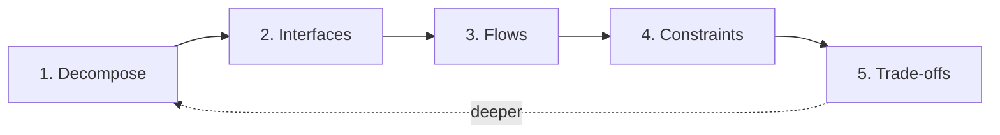

# What System Design Actually Is

Read this first. One page. No prior knowledge needed.

---

## The problem it solves

You have something too complicated to hold in your head at once.

An ATV. A delivery app. A robot. It has dozens of parts, they affect each other in
ways that are not obvious, and four different people are working on different bits of
it with different assumptions.

System design is the practice of making that tractable: cutting the thing into parts
small enough to think about, being precise about what passes between those parts, and
being honest about what you chose and what you gave up.

It is not drawing boxes. Boxes are how you record it. The design is the thinking.

---

## The five moves

Every system design, in any domain, is these five moves. The nouns change completely
between an ATV and a chat application. The moves do not.

### 1. [Decompose](1-decompose.md), what are the parts?

Cut the system into blocks. Each block gets **one responsibility** you can state in a
sentence without using "and" twice.

The cut is a real decision, not a discovery. There are several valid ways to split any
system and they are not equally good. A bad cut makes everything downstream harder,
because it puts the boundaries in places where lots of things have to cross them.

### 2. [Interfaces](2-interfaces.md), what crosses between them?

For every block: what goes in, what comes out, and **exactly what is it**.

Not "data". *Which* data, in what form, how often, in what units, how much.

This is where beginners' designs are weakest and it is the highest-value move of the
five. Pick any arrow in a diagram and ask what travels along it. If there is no
answer, that arrow is decoration and the design has a hole where a decision should be.

### 3. [Flows](3-flows.md), trace it end to end

Follow one thing all the way through the system. Not one hop, the whole path.

Four kinds, and they are genuinely different things that get drawn with the same
arrow by people who have not been told to separate them:

| Flow | The question |
|---|---|
| **Data / signal** | Where does a measurement go, from sensing to being acted on? |
| **Power** | Where does energy come from, and does every consumer have a supply path? |
| **Control** | Who decides, and how does a command reach the thing that carries it out? |
| **Mechanical / physical** | What is attached to what? Where do loads and motion go? |

Power is the one that gets forgotten. A diagram where four things compute and nothing
supplies them is a diagram of something that will not switch on.

### 4. [Constraints](4-constraints.md), what limits you?

What it must do (functional). How well, **in numbers** (non-functional). What boxes
you in, budget, available parts, rules, weight, time, your team's skills. And what
you are **assuming** without having checked.

An unstated assumption is indistinguishable from a mistake. Writing it down converts
a future argument into a checkable item.

### 5. [Trade-offs](5-tradeoffs.md), what did you give up?

Every real decision costs something. Name the option you **rejected** and why, and
name what your choice costs you.

A choice with no named alternative was not a decision, it was a default you did not
notice making. And a trade-off presented with no downside is not a trade-off, it is a
sales pitch.

---

## It loops

You do not finish move 5 and stop.

Trade-offs reveal a part you missed. Tracing a flow shows that a block was really two
blocks. A constraint you had not written down kills your interface choice. So you go
round again, at a finer level of detail.

**That loop is what HLD and LLD actually are.** First pass over the five moves gives
you the high-level design: the major blocks and what passes between them. Second pass,
applied to one block, gives you a low-level design for that block. Same five moves,
tighter zoom. There is no separate HLD skill and LLD skill.

More: [HLD vs LLD](../02-concepts/hld-vs-lld.md)

---

## Why this order

It is not arbitrary, and the order is load-bearing:

- You cannot define an **interface** before you know where the **boundary** is, since
  an interface is by definition something that crosses a boundary.
- You cannot trace a **flow** before the interfaces have types, because a flow is a
  sequence of interfaces.
- You cannot evaluate a **trade-off** before you know the **constraints**, because the
  constraints are what you are trading against.

Skipping forward is the most common way a design goes wrong. Someone picks a
technology at move 1, which quietly answers moves 2 through 5 for them, and nobody
ever notices the choices were made.

---

## Common first mistakes

| Mistake | What to do instead |
|---|---|
| Starting by naming parts or technologies | Start with the boundary. What is inside, what is outside. |
| Arrows with no stated content | Every arrow carries a named, typed thing. |
| Mixing levels of zoom in one diagram | Keep one level per diagram. Zoom in with a separate one. |
| Forgetting power entirely | Trace energy to every single consumer. |
| "It should be fast" | "Responds in under 100 ms." Numbers, not adjectives. |
| Naming a block after a technology | Name it after its responsibility. The technology is a later choice. |

---

## Now do one

1. Pick something, your ATV, a vending machine, a drone, a bus route display.
2. Open **[the design prompt](../06-workshop/ai-prompts/design-something-new.md)**.
   An AI interviews you through all five moves and refuses to answer for you.
3. Draw it: **[block diagramming conventions](../02-concepts/block-diagramming-conventions.md)**.
4. Audit it: **[the review prompt](../06-workshop/ai-prompts/review-my-design.md)**.

The five moves do not become real by being read. Run them once on something small and
they will make considerably more sense than this page did.
