# Autoware — An Open Autonomous Driving Stack

| | |
|---|---|
| **Domain** | Automotive / robotics |
| **Difficulty** | Intermediate |
| **Illustrates** | Boundaries · decomposition · interfaces · a real architecture rewrite |
| **Primary sources** | [Autoware Documentation — Architecture overview](https://autowarefoundation.github.io/autoware-documentation/main/design/autoware-architecture-v1/) · [Autoware 2.0 Architecture](https://autowarefoundation.github.io/autoware-documentation/main/design/autoware-architecture-v2/) · [Autoware Foundation](https://autoware.org/) |

> **Why this one first.** It is the only complete autonomous-vehicle architecture that
> is fully public, *and* its documentation states the reasoning — including what was
> deliberately left out. That makes it the rare case study where you can read the
> trade-offs rather than guess them.

---

## 1. What it is

Autoware is open-source software for driving a vehicle autonomously. It runs on ROS 2,
reads from the vehicle's sensors, and outputs steering, throttle and brake commands.

In our terms: it is the **software** subsystem of an autonomous vehicle. Not the
sensors, not the actuators, not the vehicle. That distinction is the first thing to
get right, and it is a boundary decision.

---

## 2. Boundary

**Inside:** seven software stacks — Sensing, Map, Localization, Perception, Planning,
Control, Vehicle Interface.

**Outside but connected:** the physical sensors (LiDAR, camera, GNSS, IMU), the HD map
data, and the vehicle's own actuators.

**Deliberately not doing — stated outright in their documentation.** The v1
architecture says its initial focus "was solely on driving capability", leaving these
as future work:

- Fail safe
- Human Machine Interface
- Real-time processing
- Redundant system
- State monitoring system

**Stop and look at that list.** A self-driving system that explicitly defers fail-safe
behaviour, redundancy and real-time guarantees. That is not sloppiness — it is a
project saying *we are solving the driving problem first, and we are telling you so*.

Compare it with how most student projects handle scope: silently. An unstated omission
looks identical to an oversight. A stated one is a decision someone can argue with,
plan around, or fund.

**This single list is the most valuable thing on this page.** Copy the habit.

---

## 3. Decomposition



| Stack | Responsibility |
|---|---|
| **Sensing** | Acquire data from LiDAR, GNSS, IMU and cameras; pre-process it for Perception and Localization |
| **Map** | Supply HD map data — road geometry, traffic rules |
| **Localization** | Fuse sensor data to estimate where the vehicle is and how it is oriented |
| **Perception** | Add semantic meaning — object recognition, obstacle segmentation, traffic lights, occupancy grid |
| **Planning** | Produce a safe, feasible trajectory |
| **Control** | Follow that trajectory; emit steering, throttle and brake commands |
| **Vehicle Interface** | Translate commands into what this specific vehicle understands |

Every one of those is a single responsibility statable without "and" twice. That is not
an accident.

### Why this cut, in their own words

The documentation gives three reasons for the layered split:

1. Internal processing becomes **more transparent**.
2. Collaborative development is easier because of **reduced interdependency** between
   modules.
3. Users can **replace a module** — swap in their own localization — by wrapping their
   software to fit the interface.

Reason 3 is the one worth internalising. The architecture is cut along the lines where
people most want to substitute their own work. That is a design goal most beginners
never consider: *decompose where the seams need to be, not where the diagram looks
neat.*

### The Vehicle Interface stack

Note that **Vehicle Interface is its own stack**, not folded into Control.

Why: Control computes *what the vehicle should do*. Vehicle Interface translates that
into *what this particular vehicle's CAN messages look like*. Separating them means
porting Autoware to a different vehicle touches one stack instead of bleeding through
the whole system.

That is the clearest example in this repository of a boundary drawn to contain change.

---

## 4. Interfaces and flows

**Every arrow in the diagram is data flow.** Power and mechanical flow do not appear —
and that is correct here, because Autoware is software. The vehicle has a power
architecture; Autoware does not.

Say that explicitly in your own designs rather than silently omitting it.

Tracing one path end to end:

```
LiDAR  →  Sensing  →  Localization  →  Planning  →  Control  →  Vehicle Interface  →  steering actuator
                 ↘   Perception    ↗
          Map  ──────────────────↗
```

Notice Map feeds three stacks, Localization feeds two. **Blocks consumed by many
others are the expensive ones to change** — a lesson that transfers directly to any
system.

---

## 5. The architecture rewrite — the real lesson

Autoware is now developing a **second architecture**, and the reason is documented.



### The problem with v1

The v1 pipeline is fixed:

> Sensing → Perception → Localization → Planning → Trajectory

The docs state this "works well for rule-based planners", but newer approaches —
end-to-end and diffusion models — "don't fit neatly into that structure. They may skip
or replace parts of the pipeline, making integration difficult."

Read that again. **The architecture that made collaboration easy also made a whole
class of new technique hard to adopt.** The strength and the weakness are the same
property.

### The v2 answer

They "abstracted away the front half of the pipeline":

- A **Generator** is any module that outputs trajectories — a rule-based planner, an
  end-to-end model eating raw sensor data, a sampling planner. Several can run in
  parallel. Each may use Autoware's sensing and perception, or bypass them entirely.
- The **Selector** receives candidate trajectories, safety-checks them against rules
  and the drivable area, then ranks and picks one.

### Why this is a textbook trade-off

The documented benefit is "safe use of black-box models through explicit checks".

That is the move: they could not make a learned model explainable, so instead they
**changed the boundary** so that an unexplainable model is always followed by an
explicit, inspectable safety gate. The uncertainty is not removed; it is *contained*.

**What it costs:** a fixed pipeline tells you exactly where any behaviour came from.
With several generators competing and a selector arbitrating, "why did the car do
that?" becomes a harder question. They traded diagnosability for flexibility.

> The v2 documentation is marked **Under Construction**. Treat it as direction of
> travel, not finished fact — and say so when you cite it.

---

## 6. What to steal from this

| Habit | Where you saw it |
|---|---|
| **List what you are not doing.** | The five deferred features, stated up front |
| **Cut along seams people want to replace.** | Modules swappable by wrapping an interface |
| **Isolate the vehicle-specific part.** | Vehicle Interface as its own stack |
| **Say when a flow does not apply.** | No power flow, because it is software |
| **Contain what you cannot explain.** | Selector gating black-box generators |
| **Expect to be rewritten.** | v1 → v2, for a reason that did not exist when v1 was designed |

---

## 7. What they do not tell you

Every public architecture has gaps. Finding them is the exercise.

- **No numbers.** No latency budget, no compute requirement, no update rates. You
  cannot tell from the architecture docs whether this runs on a Jetson or needs a
  workstation.
- **No failure behaviour in v1.** Fail-safe is listed as future work, so what happens
  when Perception stops publishing is simply not specified at this level.
- **Configurations vary.** The docs note Autoware is "scalable / selectable" and
  varies by environment — so the node diagram is one configuration, not the system.
- **v2 is incomplete.** Marked Under Construction. How the Selector ranks candidates
  is where the difficulty actually lives, and it is not yet written down.

Each gap is a question you would have to answer for your own ATV. That is why the gaps
are worth listing.

---

## 8. Do this yourself

1. Open the [architecture overview](https://autowarefoundation.github.io/autoware-documentation/main/design/autoware-architecture-v1/) and read it properly.
2. Pick **one** stack — Perception is the richest — and follow it into the component
   docs.
3. Draw **that stack's** LLD from the
   [starter template](../../02-concepts/diagrams/starter-template.drawio.svg). Do not
   copy their diagram.
4. Score it with the [HLD Scorecard](https://claude.ai/artifact/2tr1jH6Zyyt6LCDXTPfsGR) — upload your
   `.drawio` file directly.
5. Then answer: **where would an ATV's architecture differ, and why?** You have no HD
   map, far less compute, and a driver in the seat. Which stacks survive, which
   collapse, which disappear?

Question 5 is the one worth your evening.

---

**Sources:** [Autoware Documentation — Architecture overview](https://autowarefoundation.github.io/autoware-documentation/main/design/autoware-architecture-v1/) · [Autoware 2.0 Architecture](https://autowarefoundation.github.io/autoware-documentation/main/design/autoware-architecture-v2/) · [Perception component design](https://autowarefoundation.github.io/autoware-documentation/main/design/autoware-architecture-v1/perception/) · [Autoware Foundation](https://autoware.org/)
