# Netflix — Getting Video to 300 Million Screens

| | |
|---|---|
| **Domain** | Software / distributed systems |
| **Difficulty** | Intermediate |
| **Illustrates** | Control flow vs data flow · boundaries across organisations · a named failure mode |
| **Primary sources** | [Netflix Open Connect](https://openconnect.netflix.com/en/) · [Open Connect Overview (PDF)](https://openconnect.netflix.com/Open-Connect-Overview.pdf) · [Serving 100 Gbps from an Open Connect Appliance](https://netflixtechblog.com/serving-100-gbps-from-an-open-connect-appliance-cdb51dda3b99) · [How Netflix works with ISPs](https://about.netflix.com/en/news/how-netflix-works-with-isps-around-the-globe-to-deliver-a-great-viewing-experience) |

> **Why this one.** It is the cleanest real example of **control flow and data flow
> being different things** — the distinction students most often collapse into one
> arrow. At Netflix they are not just different arrows; they are different systems, on
> different hardware, in different buildings, run by different organisations.

---

## 1. The problem

Deliver high-bitrate video to hundreds of millions of people at once, over networks
Netflix does not own, without the internet buckling at 8pm.

Video is enormous and extremely repetitive — a very large number of people watch the
same few hundred titles. That one observation drives the entire architecture.

---

## 2. Boundary — and this is the interesting part

**Inside Netflix's design:** the control plane in AWS, the Open Connect Appliances
(OCAs), the encoding pipeline, the client applications.

**Outside but connected:** the viewer's device, **the ISP's network — and the ISP's
own racks**.

Here is what makes this case study unusual: **part of Netflix's system is physically
installed inside another company's building.** Open Connect Appliances are deployed
directly in ISP networks, and the ISP controls which of its customers get routed to
its embedded OCA.

So the boundary is not only technical. It is contractual, organisational and physical.

**Ask it of your own project:** does your boundary cross an organisation? Who owns the
hardware on the far side? Who can power it off without telling you?

---

## 3. The architecture

### Two planes, deliberately separate

| | **Control plane** | **Data plane** |
|---|---|---|
| **Where** | AWS | OCAs — in ISPs, at IXPs, in 60+ Netflix sites |
| **Carries** | Decisions: who you are, what you may watch, which server to use | The video bytes |
| **Traffic** | Tiny | Essentially all of it |
| **Latency need** | Once, at the start of playback | Sustained for the whole film |

In the diagram, control flow is **dashed** and data flow is **thick**. That is not
decoration — it is the single most important fact about this system.

### A play, step by step

1. Your device asks the **Playback API** in AWS to play something. *(control)*
2. The **Steering service** decides which OCA you should use, based on file
   availability, appliance health and network proximity, and returns URLs. *(control)*
3. Your device fetches video over HTTP/HTTPS **directly from that OCA**. *(data)*

The bytes never touch AWS. The decision never touches the ISP's appliance.

### How content arrives — the asymmetry

OCAs are filled **overnight**, during off-peak hours, under control-plane direction
that computes what each appliance should store.

This is the part worth pausing on. Netflix turned a hard real-time problem into an
easy batch one by exploiting something true about their content: **it is known in
advance.** They do not need to fetch a film when you press play; they can predict
which films matter in your region and put them nearby while everyone is asleep.

That is not a clever implementation. It is a *modelling* decision about the problem,
made before any of the implementation existed — and it is why the system is shaped
this way.

### What runs on an OCA

Commodity PC hardware in custom cases, running **FreeBSD** and **NGINX**, with
**BIRD** as the routing daemon to learn ISP network topology and report it back to
AWS. Storage appliances reach around 200 Gbps.

The important bit for a system designer: OCAs are *deliberately simple*. They cache
files and serve them over HTTP. All the intelligence sits in AWS. Putting cleverness
in a box installed in somebody else's building, which you cannot easily reach, would
be a poor trade.

---

## 4. The failure mode they publish

From Netflix's own documentation:

> **If an OCA loses connectivity to the AWS control plane, it stops serving traffic.**

Sit with that. An appliance physically inside your ISP, holding a complete copy of the
film, with a working network path to you — refuses to serve it because it cannot reach
a service in another country.

**This is a deliberate trade-off, not a bug.** The alternative is an appliance that
keeps serving while unreachable: unsteerable, un-updatable, possibly serving withdrawn
content, invisible to telemetry. Netflix chose *fails closed* over *keeps working but
uncontrollable*.

> **The transferable question:** when your subsystem loses contact with the thing that
> coordinates it, should it keep going or stop? There is no universally right answer —
> an ATV's engine-cut logic should probably keep working when telemetry drops. But
> **it must be a decision, and it must be written down.**

Most student designs have never been asked this question, which means they answer it
by accident.

---

## 5. Why ISPs agree to this

Architecture is not only technical. The reason this works is that it is cheaper for
the ISP too: traffic served from an OCA inside their network does not traverse their
expensive transit links.

Both sides win, which is why the hardware is allowed in the building at all.

**Transferable:** when your design depends on someone else doing something, ask what
*they* get. A design that is optimal for you and costly for them does not survive
contact with reality.

---

## 6. What to steal from this

| Habit | Where you saw it |
|---|---|
| **Separate control flow from data flow.** | Two planes, different hardware, different continents |
| **Exploit what you know in advance.** | Nightly fill instead of fetch-on-demand |
| **Keep remote hardware stupid.** | Intelligence in AWS, caching at the edge |
| **Decide failure behaviour explicitly.** | Fails closed, and documented |
| **Put the heavy traffic on the short path.** | Bytes travel metres; decisions travel continents |
| **Check the other party's incentive.** | ISPs save on transit |

---

## 7. What they do not tell you

- **How steering actually ranks OCAs.** "Availability, health and proximity" is the
  shape of the answer, not the answer.
- **What fills the cache.** The prediction of what each region will watch is the
  commercially interesting part, and it is not public.
- **Capacity numbers.** Throughput per appliance is published; how many appliances,
  where, and how loaded is not.
- **The client's role.** Adaptive bitrate logic lives on your device and shapes
  perceived quality enormously; the public architecture barely describes it.

---

## 8. Do this yourself

1. Read the [Open Connect overview](https://openconnect.netflix.com/en/).
2. Draw the control plane and data plane as **two separate diagrams**, then draw the
   arrows that cross between them. Those crossings are the architecture.
3. Score it with the [HLD Scorecard](../../scorecard/hld-scorecard.html).
4. Then answer: **what is the ATV equivalent?**
   - What is your control plane? (deciding what the vehicle should do)
   - What is your data plane? (the bytes, or the current, or the torque)
   - If the link to the pit drops, does the vehicle keep running or stop?

Question 4 maps this entire case study onto something you will actually build.

---

**Sources:** [Netflix Open Connect](https://openconnect.netflix.com/en/) · [Open Connect Appliances](https://openconnect.netflix.com/en/appliances/) · [Open Connect Overview (PDF)](https://openconnect.netflix.com/Open-Connect-Overview.pdf) · [Serving 100 Gbps from an OCA](https://netflixtechblog.com/serving-100-gbps-from-an-open-connect-appliance-cdb51dda3b99) · [How Netflix works with ISPs](https://about.netflix.com/en/news/how-netflix-works-with-isps-around-the-globe-to-deliver-a-great-viewing-experience) · [Netflix Technology Blog](https://netflixtechblog.com/)
