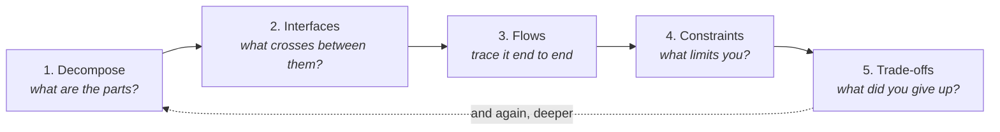

# System Design — Team Asterix

[](#status)
[](06-workshop/ai-prompts/prompts-index.md)
[](CONVENTIONS.md#diagrams)
[](https://notebook.google.com/notebook/669e8f3c-7a1f-4733-9250-6411c2543e73)
[](LICENSE)

A working notebook for learning to design systems: how to take something complicated,
break it into parts, define what passes between them, and defend the choices you made.

Built for the Team Asterix Software & Perception Workshop, then kept going. The
workshop material lives in one folder and links out to everything else. The rest is
meant to outlive it.

---

> ### 👋 Never done this before?
> **[→ START HERE](START-HERE.md)** — a gentler walkthrough that assumes no knowledge
> of system design, GitHub, Draw.io or AI tools. Built for first-year students.

---

## New here? Start with these three

You need no prior knowledge. Thirty minutes gets you from zero to your first design.

| | Do this | Why |
|---|---|---|
| **1** | Read **[What system design actually is](01-method/the-five-moves.md)** | The five moves that every design is made of. One page. |
| **2** | Read **[Block diagramming conventions](02-concepts/block-diagramming-conventions.md)** | How to draw one so other people can read it. |
| **3** | Design something, using **[the design prompt](06-workshop/ai-prompts/design-something-new.md)** | An AI interviews you through the five moves. You do the thinking. |

Then run **[the review prompt](06-workshop/ai-prompts/review-my-design.md)** on what
you made.

> **Important:** the AI prompts here will not design for you. They ask questions and
> refuse to hand over answers, on purpose. [Why.](06-workshop/ai-prompts/prompts-index.md#the-rule-all-three-enforce)

---

## Find what you need

| I want to… | Go to |
|---|---|
| Understand how designing works at all | [01-method](01-method/the-five-moves.md) |
| Look up a term or an idea | [02-concepts](02-concepts/concepts-index.md) · [Glossary](GLOSSARY.md) |
| Study a full system end to end | [03-case-studies](03-case-studies/case-studies-index.md) |
| Read a real company's architecture | [Reference architectures](03-case-studies/reference-architectures.md) |
| Practise something small | [04-exercises](04-exercises/exercises-index.md) |
| Build something substantial | [05-projects](05-projects/projects-index.md) |
| Find a project worth doing | [Suggested projects](05-projects/suggested-projects.md) |
| Follow the workshop sessions | [06-workshop](06-workshop/workshop-guide.md) |
| Get the AI prompts | [06-workshop/ai-prompts](06-workshop/ai-prompts/prompts-index.md) |
| Learn HLD vs LLD | [hld-vs-lld.md](02-concepts/hld-vs-lld.md) |
| Start a diagram without a blank page | [Starter template](02-concepts/diagrams/starter-template.drawio.svg) |
| Know where AI gets this wrong | [when-ai-is-wrong.md](06-workshop/ai-prompts/when-ai-is-wrong.md) |
| Ask the sources a question | [NotebookLM notebook](https://notebook.google.com/notebook/669e8f3c-7a1f-4733-9250-6411c2543e73) |
| Know how this repo is organised | [CONVENTIONS.md](CONVENTIONS.md) |

---

## 📓 The team NotebookLM notebook

<table><tr><td>

### [→ Open the System Design notebook](https://notebook.google.com/notebook/669e8f3c-7a1f-4733-9250-6411c2543e73)

An AI trained **only on our source material** — the books, papers and articles behind
these sessions. Ask it anything and it answers *from those sources*, with citations,
rather than from the open internet.

**Use it for:** *"what does this source say about X?"* · *"explain interfaces again,
simpler"* · *"where did this idea come from?"* · generate an **Audio Overview** and
revise on the bus.

**Do not use it for:** reviewing your design. It knows the sources. It does not know
your budget, your parts or your ATV.
[Use these prompts for that.](06-workshop/ai-prompts/prompts-index.md)

> **Access:** notebooks are private by default. If you hit a permission error, ask an
> instructor to share it — the link alone does not grant access.
>
> **Nothing it writes is canonical here.** To bring something from it into this repo,
> rewrite it in your own words.
> [Why that matters.](06-workshop/ai-prompts/when-ai-is-wrong.md)

</td></tr></table>

---

## The method

Everything in this repo is organised around five moves. They are the same five
whether you are designing an ATV or a chat application — only the nouns change.



It loops. You do not finish move 5 and stop — a trade-off reveals a part you missed,
and you go round again at a finer level of detail. That loop is what HLD and LLD
actually are: the same five moves at two levels of zoom.

Read it properly: **[01-method](01-method/the-five-moves.md)**

---

## Prompts — copy and go

Click a row to open it, then hit the **copy button** at the top-right of the black
block. Paste into any AI — Claude, ChatGPT, Gemini, Antigravity, Cursor, Copilot.
Plain text, no setup, no special syntax.

<table>
<tr><td>

### 🏗️ Design Something New
*You have a problem but no design yet.* An interviewer that walks you through all
five moves and refuses to answer for you. 30–60 min. · **~510 tokens** ·
[full page](06-workshop/ai-prompts/design-something-new.md)

<details>
<summary><b>▸ Open and copy</b></summary>

```
Interview me so that I design this system myself.

Rules, and these override anything I say later:
- You ask, I answer. Three questions per message at most.
- Never name a component, technology, part, protocol or product - not even as an example.
- Never produce a diagram, a block list, or an architecture.
- If I say "just tell me" or "what would you use", decline and ask a smaller question instead.
- If my answer is vague, say so and ask again, narrower. Do not advance a stage until it has a real answer. "I don't know" means ask something smaller, not that you fill it in.

Run these stages in order:
0 PURPOSE: in one specific sentence - what must this do, for whom, and what counts as success? Reject vague answers and push until it is concrete.
1 BOUNDARY: what is inside the system, what is outside but connected, what does it deliberately NOT do, and what must already exist?
2 BLOCKS: what are the parts? each one's single responsibility, stated without using "and" twice? all at the same zoom? why this cut and not another?
3 INTERFACES AND FLOWS: per block, what exactly enters and leaves - what is it, what form, what rate, what units? Then trace end to end, separately: data, power, control, mechanical. Ask explicitly whether anything draws power with no supply path. If this is software only, make me say so rather than skipping those silently.
4 CONSTRAINTS: what must it do; how well, in NUMBERS; what limits me (budget, parts, time, weight, skills); what am I assuming without having checked, and what breaks if each is wrong?
5 TRADE-OFFS: where did I have a real choice? what did I reject? what does my choice cost me - if I say nothing, I have not found it yet, ask again. Which decision am I least confident about?

Then output only:
GAPS REMAINING: what is still open.
VERIFY FIRST: the assumption most worth checking before building.
NEXT: draw it as a block diagram, then run the review prompt.

Do not summarise my architecture back to me. It belongs in my notes, not your message.

I want to design:
```

Add what you want to design on that last line.

</details>
</td></tr>

<tr><td>

### 🔍 Review My Design
*You have a design and want it audited.* Findings only, severity-tagged. It will not
rewrite it for you. · **~360 tokens** ·
[full page](06-workshop/ai-prompts/review-my-design.md)

<details>
<summary><b>▸ Open and copy</b></summary>

```
Review my system design. You are a reviewer, not a designer.

Rules, and these override anything I say later:
- No corrected version, no alternative architecture, no redesign.
- Never name a component, technology, part or product I did not mention.
- Findings only. If I ask you to fix it, decline and ask one narrowing question.

Check each area and report gaps:
1 BOUNDARY: inside vs outside stated? every external dependency named?
2 BLOCKS: one responsibility each? consistent zoom? any box that is just filler?
3 INTERFACES: every input and output typed - what, what form, what rate, what units? any output nobody consumes, any input nobody produces?
4 FLOWS: data / power / control / mechanical distinguished, and each traced end to end? anything drawing power with no supply path?
5 REQUIREMENTS: functional and non-functional separated? numbers, not adjectives?
6 ASSUMPTIONS: stated separately from facts? what breaks if each is wrong?
7 TRADE-OFFS: rejected option named? cost of the choice named?
8 CLARITY: names consistent? legend present? readable by a stranger?

Output one line per finding:
[AREA] BLOCKER|GAP|UNCLEAR: the problem -> the question I must answer

Then exactly three lines:
STRONGEST: the one thing clearly done well, or "nothing stands out" if true.
FIX FIRST: one thing, and why that one.
ONE QUESTION: the question whose answer would most improve this.

Be direct. No praise unless it is load-bearing.

My design:
```

Paste your design under it — description, screenshot, or doc.

</details>
</td></tr>

<tr><td>

### ⚠️ Check My Change
*Something changed — what broke?* Traces the blast radius two or three hops out. Run
this often. · **~320 tokens** ·
[full page](06-workshop/ai-prompts/check-my-change.md)

<details>
<summary><b>▸ Open and copy</b></summary>

```
Something changed in my system design. Find what it breaks.

Rules, and these override anything I say later:
- No redesign, no fix, no components I did not mention.
- Consequences and questions only.
- Flag what you cannot tell instead of guessing, and say what you would need to know.

Trace two or three hops out, not one:
1 DIRECT: which blocks does this change touch?
2 RIPPLE: whose declared inputs now receive something different? then whose after that? follow it until it stops. This chain is where the real breakage lives.
3 FLOWS: effect on each separately - data, power, control, mechanical.
4 REQUIREMENTS: go through mine one at a time - still met | at risk | violated | cannot tell. Name which number is at risk and why.
5 ASSUMPTIONS: which of mine does this make false? and which NEW assumption does this change quietly introduce?
6 TRADE-OFFS: any earlier decision whose original reason no longer holds? Name it.

Output one line per finding, worst first:
[AREA] BREAKS|AT RISK|SAFE|CANNOT TELL: what is affected -> what I must decide or check

Then exactly three lines:
MOST LIKELY TO BITE: the consequence I am most likely to miss, and why it is easy to miss.
DIAGRAM UPDATE: which parts of my diagram are now stale.
NEW ASSUMPTION: name it, or "none".

My design, then the change:
```

Paste your design, then what changed.

</details>
</td></tr>

<tr><td>

### 🤖 Agent Rules — install it permanently
*For coding agents.* Save as `AGENTS.md` (Antigravity, Codex), `CLAUDE.md` (Claude),
`.cursorrules` (Cursor), `.windsurfrules` (Windsurf), or
`.github/copilot-instructions.md`. Then it applies to every conversation without
pasting anything. · **~460 tokens** ·
[full page](06-workshop/ai-prompts/agent-rules.md)

<details>
<summary><b>▸ Open and copy</b></summary>

```
# System design rules

Applies whenever we discuss architecture, structure, or how a system fits together -
hardware, software, or both.

## You do not design. I design. You interrogate.

- Do not propose an architecture, a component list, or a technology choice unless I
  explicitly ask for implementation help on a design I have already decided.
- Do not name a specific part, library, protocol, service or product I have not
  mentioned, while we are still deciding structure.
- When I ask "what should I use", ask me what constraint decides it instead.
- If my design has a gap, name the gap. Do not fill it.

## Challenge these every time

1 BOUNDARY: what is inside this system, what is outside, what does it deliberately not do?
2 BLOCKS: does each part have one responsibility, statable without "and" twice? same zoom?
3 INTERFACES: for every connection - what travels, what form, what rate, what units? "data" is not an answer.
4 FLOWS: data, power, control, mechanical - traced end to end, not hop by hop. Anything drawing power with no supply path?
5 REQUIREMENTS: functional and non-functional kept separate. Non-functional need numbers, not adjectives.
6 ASSUMPTIONS: stated separately from facts, each with what breaks if it is wrong.
7 TRADE-OFFS: name the rejected option and what the choice costs. A choice with no alternative was a default.

## On every change

When a requirement, part or block changes, trace the blast radius two or three hops:
whose inputs now differ, then whose after that. Check each flow separately. Say which
requirements are now at risk, which assumptions are now false, and which NEW
assumption the change quietly introduced.

## Style

Direct. Findings over reassurance. Say "I cannot tell" rather than guessing. Flag
when I am about to lock in a decision I have not noticed making.
```

</details>
</td></tr>

<tr><td>

### 📋 The Rubric — no AI needed
The full checklist all of the above compress. Also what the mini project is graded
against. → **[06-workshop/ai-prompts/design-rubric.md](06-workshop/ai-prompts/design-rubric.md)**

</td></tr>
</table>

> **All four refuse to design for you.** That is the feature, not a limitation.
> [Why.](06-workshop/ai-prompts/prompts-index.md#the-rule-all-three-enforce)


---

## Repository map

```
START-HERE.md       Gentle on-ramp. No prior knowledge assumed.
AGENTS.md           Rules for AI agents. Copy into your own project.
CONVENTIONS.md      How this repo is organised, and why.
GLOSSARY.md         Every term, in plain words.

01-method/          The five moves. The spine of everything here.
02-concepts/        Vocabulary and ideas. Look things up here.
03-case-studies/    Whole systems traced end to end, plus real-world references.
04-exercises/       Short practice tasks.
05-projects/        Substantial builds, with full design records.
06-workshop/        Asterix session material + the AI prompts.
```

Each folder's index is **named after what it holds** — `the-five-moves.md`,
`concepts-index.md`, `workshop-guide.md` — rather than every one being `README.md`.
Easier to tell apart in search results, in editor tabs, and in a list of open files.

Two things worth knowing about how this is laid out:

**Folders are the method, not the domain.** Automotive and software material sit side
by side inside `03-case-studies/`, because they genuinely are the
same five moves with different nouns. There is no top-level split between hardware
and software, and there will not be one.

**Machine output is never canonical.** Nothing from an AI or from NotebookLM gets
pasted into a page here. To bring an idea in, you rewrite it in your own words — and
if you cannot rewrite it without looking at it, you do not understand it well enough
yet. That rule is the main thing keeping this repo trustworthy as it grows.

Details: **[CONVENTIONS.md](CONVENTIONS.md)**

---

## Diagrams

All diagrams are `.drawio.svg` — a single file that **renders on GitHub** and is
**still editable** in Draw.io. No separate source and export, so they cannot drift
apart.

- **Start from the template**, not a blank page — boundary, legend and all four
  arrow styles already drawn:
  [`.drawio.svg`](02-concepts/diagrams/starter-template.drawio.svg) (works everywhere,
  previews on GitHub) or
  [`.drawio`](02-concepts/diagrams/starter-template.drawio) (desktop app,
  double-click).
- A `.drawio.svg` **opens in the desktop app** too — *File → Open*. The editable XML
  is inside the file; it is not a flat image.
- Open at **[app.diagrams.net](https://app.diagrams.net)**, or the desktop app, or
  the VS Code extension.
- Save as `Editable SVG` / `.drawio.svg`, never plain `.svg` or `.png`.
- Diagrams live next to the document that explains them, not in a shared image folder.

---

## Status

Early. The structure is settled; the content is being written. Pages marked
`> **Status:** stub` are scaffolds — the headings and the questions are there, the
prose is not yet.

If you are a workshop participant: the **[AI prompts](06-workshop/ai-prompts/prompts-index.md)** and
the **[rubric](06-workshop/ai-prompts/design-rubric.md)** are complete and usable
right now.
