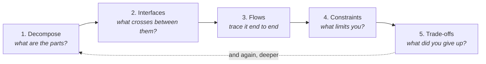

# System Design — Team Asterix

A working notebook for learning to design systems: how to take something complicated,
break it into parts, define what passes between them, and defend the choices you made.

Built for the Team Asterix Software & Perception Workshop, then kept going. The
workshop material lives in one folder and links out to everything else. The rest is
meant to outlive it.

---

## New here? Start with these three

You need no prior knowledge. Thirty minutes gets you from zero to your first design.

| | Do this | Why |
|---|---|---|
| **1** | Read **[What system design actually is](01-method/README.md)** | The five moves that every design is made of. One page. |
| **2** | Read **[Block diagramming conventions](02-concepts/block-diagramming-conventions.md)** | How to draw one so other people can read it. |
| **3** | Design something, using **[the design prompt](07-workshop/ai-prompts/design-something-new.md)** | An AI interviews you through the five moves. You do the thinking. |

Then run **[the review prompt](07-workshop/ai-prompts/review-my-design.md)** on what
you made.

> **Important:** the AI prompts here will not design for you. They ask questions and
> refuse to hand over answers, on purpose. [Why.](07-workshop/ai-prompts/README.md#the-rule-all-three-enforce)

---

## Find what you need

| I want to… | Go to |
|---|---|
| Understand how designing works at all | [01-method](01-method/) |
| Look up a term or an idea | [02-concepts](02-concepts/) · [Glossary](GLOSSARY.md) |
| See a small worked example | [03-examples](03-examples/) |
| Study a full system end to end | [04-case-studies](04-case-studies/) |
| Practise something small | [05-exercises](05-exercises/) |
| Build something substantial | [06-projects](06-projects/) |
| Follow the workshop sessions | [07-workshop](07-workshop/) |
| Get the AI prompts | [07-workshop/ai-prompts](07-workshop/ai-prompts/) |
| See automotive / ATV material | [examples](03-examples/automotive/) · [case studies](04-case-studies/automotive/) |
| See software / backend material | [examples](03-examples/software/) · [case studies](04-case-studies/software/) |
| Learn HLD vs LLD | [hld-vs-lld.md](02-concepts/hld-vs-lld.md) |
| Know how this repo is organised | [CONVENTIONS.md](CONVENTIONS.md) |

---

## The method

Everything in this repo is organised around five moves. They are the same five
whether you are designing an ATV or a chat application — only the nouns change.



It loops. You do not finish move 5 and stop — a trade-off reveals a part you missed,
and you go round again at a finer level of detail. That loop is what HLD and LLD
actually are: the same five moves at two levels of zoom.

Read it properly: **[01-method](01-method/)**

---

## Prompts — copy and go

The full prompts are on their own pages, and GitHub puts a **copy button** on the
top-right of every code block there. One click.

| | Prompt | Use when |
|---|---|---|
| 🏗️ | **[Design Something New](07-workshop/ai-prompts/design-something-new.md)** | Problem, but no design yet |
| 🔍 | **[Review My Design](07-workshop/ai-prompts/review-my-design.md)** | Design exists, want it audited |
| ⚠️ | **[Check My Change](07-workshop/ai-prompts/check-my-change.md)** | Something changed, what broke? |
| 📋 | **[The Rubric](07-workshop/ai-prompts/design-rubric.md)** | Self-check, no AI needed |

### Pocket versions

Short standalone variants for when you want something quick. Not as thorough as the
full prompts — use those for real work.

<details>
<summary><b>Pocket review</b> — click to expand, then copy</summary>

```
Review my system design below. You are a reviewer, not a designer.

Do not give me a corrected version, do not name any component, part, technology or
product I did not mention, and do not sketch an alternative. Findings only. If I ask
you to just fix it, decline and ask me a narrowing question instead.

Check: (1) is the system boundary stated, inside and outside? (2) does every block
have one clear responsibility, all at the same level of zoom? (3) does every block
declare its inputs and outputs with types, rates and units? (4) are data, power,
control and mechanical flows distinguished, and is each traced end to end? (5) are
functional and non-functional requirements separate, with numbers not adjectives?
(6) are assumptions stated separately from facts? (7) is any trade-off named with
the option I rejected and what my choice costs me?

Then tell me, in one line each: the single thing to fix first and why, and the one
question whose answer would most improve this design.

Be direct. No compliments unless they are load-bearing.

My design:
```

</details>

<details>
<summary><b>Pocket interrogator</b> — click to expand, then copy</summary>

```
Interview me so that I design this system myself.

Rules you must keep: you ask, I answer. Never name a component, part, technology or
product, not even as an example. Never produce a diagram or an architecture. If I ask
you to just tell me, decline and ask me a smaller question instead. Two or three
questions per message, maximum. If my answer is vague, say so and ask again more
narrowly.

Walk me through these in order, and do not advance until the current one has a real
answer: (0) in one specific sentence, what must this do, for whom, and what counts as
success? (1) what is inside the system, what is outside, and what does it explicitly
not do? (2) what are the parts, and what is each one's single responsibility?
(3) for each part, what exactly enters and leaves — what form, what rate, what units?
Then trace data, power, control and mechanical flow end to end, each one. (4) what
must it do, how well in numbers, what limits me, and what am I assuming without
having checked? (5) where did I have a real choice, what did I not pick, and what
does my choice cost me?

At the end, tell me only what gaps remain and which assumption to verify first. Do
not summarise my architecture back to me.

I want to design:
```

</details>

<details>
<summary><b>Pocket change-check</b> — click to expand, then copy</summary>

```
Something changed in my system design. Tell me what it breaks. Do not redesign
anything and do not name components I did not mention.

Trace the ripple two or three hops out, not one: which blocks are directly affected,
then whose inputs now receive something different, then whose after that. Check data,
power, control and mechanical flow separately. Go through my requirements one at a
time and mark each still met / at risk / violated / cannot tell. Name which of my
assumptions this makes false, and name any NEW assumption this change quietly
introduces. Say whether any earlier trade-off was decided on grounds that no longer
hold.

End with the one consequence I am most likely to miss, and why it is easy to miss.

My design, then the change:
```

</details>

---

## Repository map

```
01-method/          The five moves. The spine of everything here.
02-concepts/        Vocabulary and ideas. Look things up here.
03-examples/        Small, single-point illustrations.
04-case-studies/    Whole systems, traced end to end.
05-exercises/       Short practice tasks.
06-projects/        Substantial builds, with full design records.
07-workshop/        Asterix session material + the AI prompts.
99-inbox/           Unverified input and unfiled notes. Not canonical.
```

Two things worth knowing about how this is laid out:

**Folders are the method, not the domain.** Automotive and software material sit side
by side inside `03-examples/` and `04-case-studies/`, because they genuinely are the
same five moves with different nouns. There is no top-level split between hardware
and software, and there will not be one.

**`99-inbox/` is quarantine.** Anything in there is raw input — machine-generated
notes, half-formed thoughts, things captured at 11pm with nowhere to file them. It is
*not* verified and *not* anyone's considered understanding. Everything outside
`99-inbox/` has been written or rewritten deliberately. That line is the main thing
keeping this repo trustworthy as it grows.

Details: **[CONVENTIONS.md](CONVENTIONS.md)**

---

## Diagrams

All diagrams are `.drawio.svg` — a single file that **renders on GitHub** and is
**still editable** in Draw.io. No separate source and export, so they cannot drift
apart.

- Open at **[app.diagrams.net](https://app.diagrams.net)**, or the desktop app, or
  the VS Code extension.
- Save as `Editable SVG` / `.drawio.svg`, never plain `.svg` or `.png`.
- Diagrams live next to the document that explains them, not in a shared image folder.

---

## Status

Early. The structure is settled; the content is being written. Pages marked
`> **Status:** stub` are scaffolds — the headings and the questions are there, the
prose is not yet.

If you are a workshop participant: the **[AI prompts](07-workshop/ai-prompts/)** and
the **[rubric](07-workshop/ai-prompts/design-rubric.md)** are complete and usable
right now.
